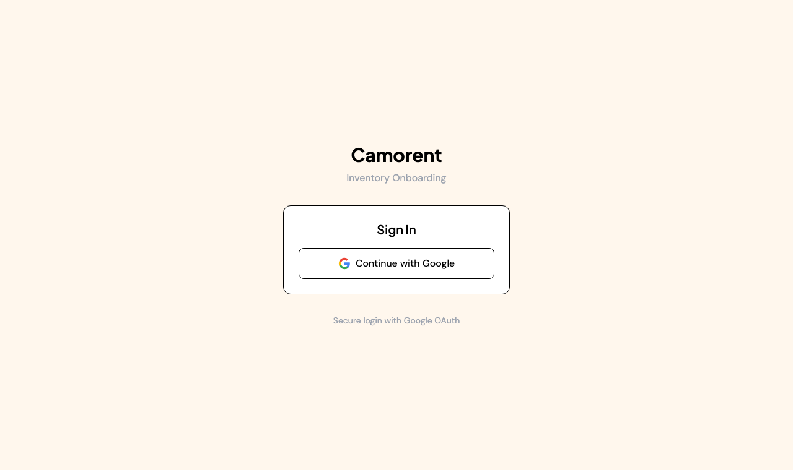

<h1 align="center">Camorent Inventory</h1>

<p align="center"><b>Add rental equipment to your inventory just by talking. AI turns your voice into a filled-in form.</b></p>

<p align="center">
  <code>● Live</code> &nbsp;·&nbsp; <a href="https://camo-inv.vercel.app"><b>camo-inv.vercel.app</b></a> &nbsp;·&nbsp; React · Flask · GPT-4o
</p>



> Instead of typing out every piece of gear, you describe it out loud. AI transcribes it, works out what the equipment is, researches the specs, and prepares the inventory form for you to confirm.

Cataloguing rental inventory is tedious data entry. Camorent Inventory makes it a voice conversation: speak a description, review the form the AI fills in, save.

## Why it exists

For a rental business, every new item means another slow manual form: model, specs, category, the lot. Talking is faster than typing, so this flips onboarding to voice-first and lets AI do the lookup and the form-filling.

## How it works

```
Record a spoken description  ->  Convert speech  ->  Understand the equipment  ->  Research specs  ->  Prepare the form  ->  Review + save
```

| Step | What happens |
|------|--------------|
| **1. Describe** | Hit record and describe the equipment in your own words |
| **2. Transcribe** | AI converts your speech to text |
| **3. Identify** | It works out what the equipment actually is |
| **4. Enrich** | It researches the specs to fill the details |
| **5. Confirm** | You review the prepared form and save it to inventory |

## Under the hood

React frontend and a Python Flask backend, Google OAuth sign-in, AI speech transcription plus equipment enrichment. Deployed on Vercel.
